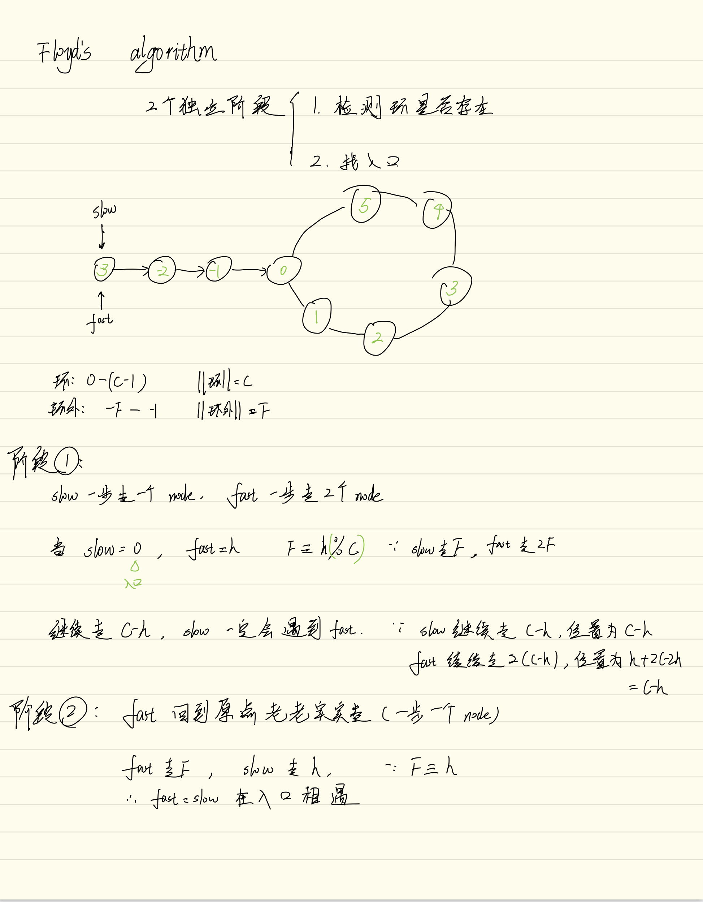

## 287 Find the duplicate number

Given an array nums containing n + 1 integers where each integer is between 1 and n (inclusive), prove that at least one duplicate number must exist. Assume that there is only one duplicate number, find the duplicate one.

**You must not modify the array (assume the array is read only).**
**You must use only constant, O(1) extra space.**
**Your runtime complexity should be less than O(n2).**

### Solution 1

We can split the figures of 1\~n into 2 parts from the middle m. Part one is 1\~m, part two is m+1\~n. If the numbers of 1\~m is more than m, than this part must has the duplicate number. Then we split this part again, like binary search. So the time complexity is O(nlogn), the sapcial complexity is O(1).

```cpp

class Solution {
public:
	int findDuplicate(const vector<int>& nums) {
		int n=nums.size();
		int left=1;
		int right=n-1;
		while(left<=right){
			int mid=left+((right-left)>>1);
			if(left==right) return left;
			int count=countNum(nums, left, mid);
			if(count<=mid-left+1)   left=mid+1;
			else    right=mid;  
		}
		return -1;
	}
private:
	int countNum(const vector<int>& nums, int left,int right){
		int count=0;
		for(auto i: nums){
			if(i>=left && i<=right)
				++count;
		}
		return count;
	}
};
```
### Solution 2

**Floyd's algorithm**

Consider the array as a Linkedlist, where the index is the value of LinkedList node, the value of the array is the index of the next node.

Let's see an array like this:

| value | 1 | 3 | 4 | 2 | 2 |

| index | 0 | 1 | 2 | 3 | 4 |

Consider the array as a LinkedList: 1->3->2->4->2

Then this problem has been turned into " Whether a LinkedList has a circle and find the entrance if there is a circle." 

Stage 1:

Set 2 pointers *slow* and *fast* point to the first node. Then pointer *slow* move 1 node per step while *fast* move 2 nodes per step. If there is a circle, *slow* will meet *fast* finally.

Stage 2:

Move *fast* back to the first node. And make it move 1 node per step. Now, *slow* and *fast* will meet in the entrance.

The proof:(https://leetcode.com/problems/linked-list-cycle-ii/solution/#approach-2-floyds-tortoise-and-hare-accepted)

and my notes of this proof:



```cpp
class Solution {
public:
    int findDuplicate(const vector<int>& nums) {
        if( nums.size()==0) return -1;
        int slow=nums[0];
        int fast=nums[0];
        slow=nums[slow];
        fast=nums[nums[fast]];
        while(slow!=fast){
            slow=nums[slow];
            fast=nums[nums[fast]];
        }
        fast=nums[0];
        while(fast!=slow){
            fast=nums[fast];
            slow=nums[slow];
        }
        return fast;
    }
};
```

## 240. Search a 2D Matrix II

Write an efficient algorithm that searches for a value in an m x n matrix. This matrix has the following properties:

- Integers in each row are sorted in ascending from left to right.
- Integers in each column are sorted in ascending from top to bottom.

Provide an example and analyse it. I find that if I start from the right-top, there is a rule that make this problem very easy.

Start from thr right-top, in the same row, every elements in the left of the number is smaller than it, in the same column, every elements below the number is larger than it. So in each iteration, we can eliminate a row or a column. If the target is larger than it, we know this row can not have the same value, we move the right-top down to next row. If the target is smaller than it, we know this column can not have the same value, we move the right-top left to next column, until we find the value or know there is not such a value. Time complexity is O(m+n), spacial complexity is O(1).

```cpp
class Solution {
public:
    bool searchMatrix(vector<vector<int>>& matrix, int target) {
        if(matrix.size()==0 || matrix[0].size()==0) return false;
        int n=matrix.size(), m=matrix[0].size();
        int row=0, col=m-1;
        while(row<n && col>=0){
            if(matrix[row][col]==target)    return true;
            if(target<matrix[row][col]) --col;
            else ++row;
        }
        return false;
    }
};
```