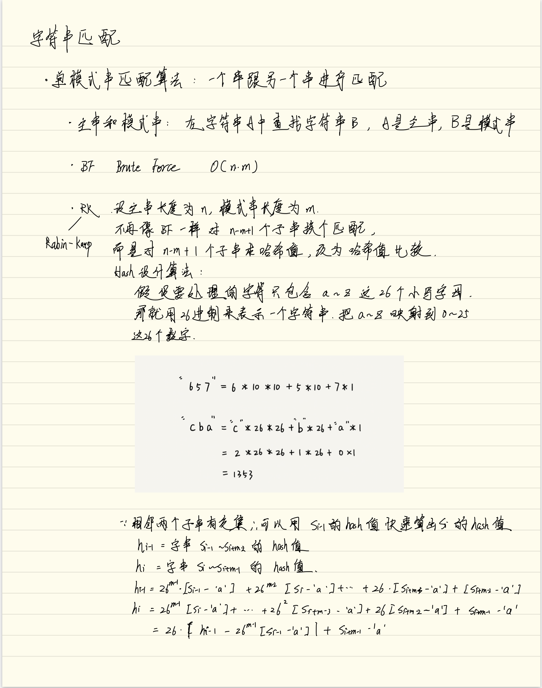

## [1078 Occurrences After Bigram](https://leetcode.com/problems/occurrences-after-bigram/)

> Given words first and second, consider occurrences in some text of the form "first second third", where second comes immediately after first, and third comes immediately after second.

> For each such occurrence, add "third" to the answer, and return the answer.

In C++, we usually use `istringstream` to change a long string into stream and split it.

In this case, we set a variable `curr` to notate the current word, and set 2 other variables to notate `first` and `second`.

When `pprev==first && prev==second`, we know `curr` is that we want.

Time O(n), space O(n)

```Cpp
class Solution {
public:
    vector<string> findOcurrences(string text, string first, string second) {
        vector<string> ans;

        istringstream iss(text);
        string pprev, prev, curr;
        while(iss>>curr){
            if(pprev==first && prev==second)
                ans.push_back(curr);
            pprev=prev;
            prev=curr;
        }
        return ans;
    }
};

```

```Java

class Solution {
    public String[] findOcurrences(String text1, String first, String second) {
        if(text1==null || first==null || second==null)
            return new String[0];
        
        String[] text=text1.split(" ", 0);
        if(text.length<3)   return new String[0];
        ArrayList<String> ans=new ArrayList<>();
        
        for(int i=2; i<text.length; ++i){
            if(text[i-2].equals(first) && text[i-1].equals(second))
                ans.add(text[i]);
        }
        String[] a=new String[ans.size()];
        ans.toArray(a);
        return a;
        
    }
}
```

## [125 Valid Palindrome](https://leetcode.com/problems/valid-palindrome/)  :triangular_flag_on_post:

> Given a string, determine if it is a palindrome, considering only alphanumeric characters and ignoring cases.

> Note: For the purpose of this problem, we define empty string as valid palindrome.

In order to save space, we just use 2 pointers, one from the string's begin to end, the other pass from the end to the begin.

Everytime meet a non-alphanumeric character, just skip. In the code, we need to notice that to out of boundary if we justing keep skipping, so we would add a restriction in the while loop.

C++

```cpp
class Solution {
public:
    bool isPalindrome(string s) {
        for(int i=0, j=s.size(); i<j; ++i,--j){
            while(!isalnum(s[i]) && i<j)    ++i;
            while(!isalnum(s[j]) && i<j)    --j;
            if(tolower(s[i])!=tolower(s[j]))    return false;
        }
        return true;
    }
};
```

Java

```Java
class Solution {
    public boolean isPalindrome(String s) {
        for(int i=0, j=s.length()-1; i<j; ++i, --j){
            while(!Character.isLetterOrDigit(s.charAt(i)) &&i <j)   ++i;
            while(!Character.isLetterOrDigit(s.charAt(j)) && i<j)   --j;
            if(Character.toLowerCase(s.charAt(i))!=Character.toLowerCase(s.charAt(j))) 
                return false;
        }
        return true;
    }
}
```

## [680 Valid Palindrome II](https://leetcode.com/problems/valid-palindrome-ii/)  :triangular_flag_on_post:

> Given a non-empty string s, you may delete at most one character. Judge whether you can make it a palindrome.

Just check it step by step using 2 pointers like the former one. If we meet unmatched characters, now we just need to check whether `S(i+1)_j` and `Si_(j-1)` are palindromes.

Java

```Java
class Solution {
    public boolean validPalindrome(String s) {
        int l=0;
        int r=s.length()-1;
        while(l<r){
            if(s.charAt(l) != s.charAt(r))
                return isPalindrome(s, l+1, r) || isPalindrome(s, l, r-1);
            l++;
            r--;
        }
        return true;
    }
    public boolean isPalindrome(String s, int l, int r){
        while(l<r){
            if(s.charAt(l)!=s.charAt(r)) return false;
            l++;
            r--;
        }
        return true;
    }
}
```

## [161 One Edit Distance](https://leetcode.com/problems/one-edit-distance/)  :triangular_flag_on_post: :green_book:

> Given two strings s and t, determine if they are both one edit distance apart.

> Note: 

> There are 3 possiblities to satisify one edit distance apart:

> Insert a character into s to get t
> Delete a character from s to get t
> Replace a character of s to get t

还是人别家的答案写的好啊

:green_book: For the case where m is equal to n, it becomes finding if there is exactly one modified charater. Now let‘s assume m<=n (if m>n we could just swap them).

We make a first pass Over S and T concurrently and stop at the first non-matching character between S and T

1. if S matches all characters in T, then check if there is an extra charater at the end of T.
2. if `|n-m|==1`, that means we must skip this non-matching character only in T and make sure the remaining characters between S and T are exactly matching.
3. if `|n-m|==0`, then we skip both non-matching characters in S and T and make sure the remaining characters between S and T are exactly matching.

```Java
class Solution {
    public boolean isOneEditDistance(String s, String t) {
        for (int i = 0; i < Math.min(s.length(), t.length()); i++) { 
            if (s.charAt(i) != t.charAt(i)) {
                if (s.length() == t.length()) // s has the same length as t, so the only possibility is replacing one char in s and t
                    return s.substring(i + 1).equals(t.substring(i + 1));
                else if (s.length() < t.length()) // t is longer than s, so the only possibility is deleting one char from t
                    return s.substring(i).equals(t.substring(i + 1));	        	
                else // s is longer than t, so the only possibility is deleting one char from s
                    return t.substring(i).equals(s.substring(i + 1));
            }
        }       
        //All previous chars are the same, the only possibility is deleting the end char in the longer one of s and t 
        return Math.abs(s.length() - t.length()) == 1;        
    }
}
```

## [65 Valid Number](https://leetcode.com/problems/valid-number/)  :triangular_flag_on_post:

We start with trimming.

If we see [0-9] we reset the number flags.
- We can only see . if we didn't see e or ..
- We can only see e if we didn't see e but we did see a number. We reset numberAfterE flag.
- We can only see + and - in the beginning and after an e
- any other character break the validation.
- At the and it is only valid if there was at least 1 number and if we did see an e then a number after it as well.

So basically the number should match this regular expression:

`[-+]?(([0-9]+(.[0-9]*)?)|.[0-9]+)(e[-+]?[0-9]+)?`

```Java
class Solution {
    public boolean isNumber(String s) {
        s=s.trim();
        boolean numberSeen=false;
        boolean eSeen=false;
        boolean pointSeen=false;
        for(int i=0; i<s.length(); ++i){
            char c=s.charAt(i);
            if(c=='+'||c=='-'){
                if(i!=0 && s.charAt(i-1)!='e')
                    return false;
            }
            else if(c>='0' && c<='9')
                numberSeen=true;
            else if(c=='.'){
                if(pointSeen || eSeen)
                    return false;
                pointSeen=true;
            }
            else if(c=='e'||c=='E'){
                if(eSeen || numberSeen==false)
                    return false;
                eSeen=true;
                numberSeen=false;
            }
            else
                return false;
        }
        return numberSeen;
    }
}
```

## [151 Reverse Words in a String](https://leetcode.com/problems/reverse-words-in-a-string/)

> Given an input string, reverse the string word by word.

To clear the problem, we may want to ask these questions:

- Does tab or newline character count as space characters?
- Could the input string contains leading or trailing spaces?
- How about multiple spaces between two words?

Also when you write the code, you may need to consider how to deal with the input is null or empty.

The one simple approach is a **two-pass** solution: first pass to split string by spaces into an array of words, then second pass to extrace the words in reversed order.

```Java
    public String reverseWords(String s) {
        String[] words=s.trim().split("\\s+");
        StringBuilder ans=new StringBuilder();
        for(int i=words.length-1; i>=0; --i){
            if(words[i]!="" && words[i]!=" "){
                ans.append(words[i]+" ");
            }
        }
        ans.delete(ans.length()-1, ans.length());
        return ans.toString();
    }
```

The time complexity and space complexity both are O(n), notice that '\\s+' is the regular expression of space or multiple space.

We can do better in one-pass, while iterating the string in reversed order. We use 2 pointers to track of a word's begin and end position. When we are at the begining of a word, we append it.

```Java
public String reverseWords(String s){
    StringBuilder ans=new StringBuilder();
    int end=s.length();
    for(int i=s.length()-1; i>=0;--i){
        if(s.charAt(i)==' '){
            end=i;
        }
        else{
            if(i==0 || s.charAt(i-1)==' ')
                ans.append(s.substring(i, end)+" ");
        }
    }
    if(ans.length()>0)
        ans.delete(ans.length()-1, ans.length());
    return ans.toString();
/* 
In the coding part, remember s.chatAt(i) is a character, so 
you need to use "'" to compare with it.
Also consider how to deal with ans.length()==0
*/
}
```
### Follow up

*The input string does not contain leading or trailing spaces and the words are always separated by a single space.*

The basic idea is that

1. reverse the entire string
2. reverse each individual word

or in turn

## [8 String to Integer (atoi)](https://leetcode.com/problems/string-to-integer-atoi/)

The heart of this problem is dealing with overflow. 

1. discards all leading whitespaces
2. sign of the number
3. overflow
4. invalid input

```Java
class Solution {
    public int myAtoi(String str) {
        final int maxDiv10=Integer.MAX_VALUE/10;
        int i=0, n=str.length();
        // go through the whitespace
        while(i<n && str.charAt(i)==' ')    ++i;
        // deal with sign
        int sign=1;
        if(i<n && str.charAt(i)=='+'){
            ++i;
        }
        else if(i<n && str.charAt(i)=='-'){
            sign=-1;
            ++i;
        }
        
        int num=0;
        while(i<n){
            if(!Character.isDigit(str.charAt(i)))   break;
            int digit=str.charAt(i)-'0';
            // deal with overflow
            if(num > maxDiv10 || num==maxDiv10 && digit>=8)
                return sign==1? Integer.MAX_VALUE:Integer.MIN_VALUE;
            num=num*10+digit;
            ++i;
        }
        return sign*num;
    }
}
```

## 字符串匹配

### RK 算法




### [1392 Longest Happy Prefix](https://leetcode.com/problems/longest-happy-prefix/)

可用 RK 算法和 KMP 算法

RK:

```Java
class Solution {
    public String longestPrefix(String s) {
        long h1=0, h2=0;
        int len=0;
        long A=1;
        final int mod=(int)1e9+7;
        for(int i=0, j=s.length()-1; i<s.length()-1; i++, j--){
            int c1=s.charAt(i)-'a';
            int c2=s.charAt(j)-'a';
            h1=(h1*26+c1)%mod;
            h2=(A*c2+h2)%mod;
            A=A*26%mod;
            if(h1==h2)  len=i+1;
        }
        return s.substring(0, len);
    }
}
```